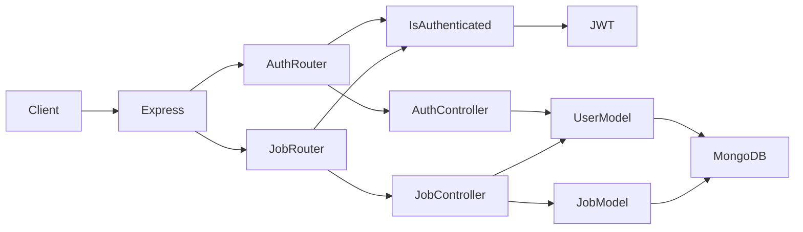

# Jobnest API — Code review and learning roadmap

This document reviews the **jobnest-api** project (Express, TypeScript, MongoDB/Mongoose) as a learning foundation, maps it to the **2026 Backend Mastery Roadmap** (`backend_roadmap_2026.md`), and lists practical next steps.

---

## Project snapshot

| Area | Current state |
|------|----------------|
| Runtime | Node.js + Express |
| Language | TypeScript |
| Database | MongoDB via Mongoose (`src/models/userModel.ts`, `src/models/jobModel.ts`) |
| Auth | JWT (httpOnly cookie + optional `Authorization: Bearer`), bcrypt (`src/utils/hashing.ts`) |
| Security middleware | Helmet, CORS (permissive default), cookie-parser |
| Validation | Joi for auth (`src/utils/validator.ts`); jobs use manual field checks |
| Tests / CI | `npm test` is still a placeholder in `package.json` |
| DevOps | No Docker/CI in repo yet |

### Request flow (high level)

---

## What you implemented well

1. **Layered structure** — Routers → controllers → models is clear and easy to extend (`src/routers/authRouter.ts`, `src/routers/jobRouter.ts`).

2. **Password hygiene** — Bcrypt hashing on register, `select: false` on the password field, `.select('+password')` on login.

3. **JWT + httpOnly cookie** — Better default than token-only in `localStorage` for many web apps; `sameSite: 'strict'` and conditional `secure` are sensible.

4. **Flexible auth extraction** — Middleware reads token from cookie or Bearer header (`src/middlewares/isAuthenticated.ts`).

5. **Admin guard** — `isAdmin` protects destructive user routes (`DELETE /api/auth/users/:id`).

6. **Ownership checks** — Job update/delete verifies `createdBy` against the authenticated user (`src/controllers/jobController.ts`).

7. **Schema design** — ObjectId refs, enums for job type and experience level, timestamps.

8. **Type augmentation** — `src/types/express.d.ts` documents `req.user`.

---

## Fixes applied (from review)

The following were corrected in code after the initial review:

| Issue | Resolution |
|-------|------------|
| JWT payload missing `verified` vs middleware expectation | Added `verified` on the user document (default `false`) and included it in `jwt.sign` on login |
| `removeJobFromApplied` only updated the user | Also `$pull` the user from the job’s `applicants` array |
| `deleteOwnJob` did not update `createdJobs` | Mirror `deleteJob`: `$pull` the job id from the creator’s `createdJobs` |
| Duplicate JSON body parsers | Removed redundant `body-parser` usage; kept `express.json()` |
| Server listened before Mongo connected | Connect to MongoDB first, then `app.listen`; exit on failure |

### Additional improvements still recommended

- Use **400** instead of **401** for validation errors on register/login (semantic HTTP).
- Align **password min length** between Joi (`src/utils/validator.ts`) and Mongoose (`userModel.ts`).
- Standardize **ESM `import`** vs `require` across routers and `src/index.ts`.
- Add **pagination** and filters on `GET /jobs`; add **central error middleware**.
- When deleting jobs globally, consider cleaning **`appliedJobs`** on all users who applied (or use soft deletes).

---

## Refactoring suggestions (incremental)

1. **Service layer** — Extract “load job + assert owner” into a small module as routes grow (roadmap: clean architecture).

2. **Job validation** — Joi/Zod for create/update payloads; reuse for OpenAPI later.

3. **Dead code** — `src/utils/sendMail.ts` until verification flows exist; `hmacProcess` in `hashing.ts` if unused.

4. **Compression** — `compression` is already a dependency; enable when response sizes matter.

---

## Scaling and feature ideas (roadmap-aligned)

| Roadmap phase | How it fits Jobnest |
|---------------|---------------------|
| **Phase 1 — Foundations** | `/api/v1`, pagination, filters, standardized errors, request IDs |
| **Phase 2 — Framework** | Optional NestJS later; or a thin service layer on Express first |
| **Phase 3 — Databases** | Redis (rate limits, cache for job lists); optional PostgreSQL + Prisma for analytics |
| **Phase 4 — Auth & security** | Refresh tokens, email verification + reset (nodemailer), rate limiting, tighter CORS |
| **Phase 5 — System design** | BullMQ for notifications/digests; WebSockets for live “new application” events |
| **Phase 6 — DevOps** | Docker Compose (API + Mongo + Redis), CI (lint/test/build), health/readiness routes, structured logs |
| **Phase 7 — AI** | Embeddings for jobs + profiles, semantic search (“AI Job Matching Platform” in roadmap) |

**Concrete portfolio features:** saved searches + email alerts; employer vs candidate roles; application status workflow; CV upload to object storage; metrics and correlation IDs.

---

## What to learn next (sequenced)

**Short term (roughly 4–8 weeks):**

1. **Automated testing** — Jest or Vitest + Supertest for auth and jobs.
2. **Single validation source** — Zod/Joi everywhere + optional OpenAPI.
3. **Redis + rate limiting** — Matches roadmap security topics.
4. **Refresh token rotation** — Deepens real-world auth.
5. **Docker + Compose** — Reproducible local and deploy path.

**Medium term:** migrations discipline (Mongo or SQL), BullMQ, observability (pino, APM).

---

## Roadmap checklist (track your progress)

Use this against `backend_roadmap_2026.md` phases.

### Phase 1 — Backend foundations

- [x] REST-style routes and JSON API
- [x] Middleware (auth, helmet, cors, parsers)
- [ ] API versioning
- [ ] Consistent error handling and status codes
- [ ] Deepen: Node event loop, streams (theory + small exercises)

### Phase 2 — Framework mastery

- [x] Express controllers and routers
- [ ] Structured logging, config validation
- [ ] Optional: NestJS or Fastify spike project

### Phase 3 — Database mastery

- [x] MongoDB + Mongoose models and refs
- [ ] Indexing strategy for job queries
- [ ] Redis introduction
- [ ] Optional: PostgreSQL + Prisma side project

### Phase 4 — Authentication & security

- [x] JWT + password hashing
- [x] httpOnly cookies + `sameSite`
- [ ] Refresh tokens
- [ ] Email verification / password reset (wire `sendMail`)
- [ ] Rate limiting
- [ ] Production CORS policy

### Phase 5 — System design

- [ ] Background jobs (e.g. BullMQ)
- [ ] Notifications design
- [ ] Optional: WebSockets

### Phase 6 — DevOps & deployment

- [ ] Dockerfile and Compose
- [ ] CI pipeline
- [ ] Environment and secrets management
- [ ] Monitoring basics

### Phase 7 — AI backend (optional advanced)

- [ ] Embeddings + vector search
- [ ] Job/resume matching experiment

### Portfolio (roadmap §16)

- [ ] Production-grade auth service (extend this API)
- [ ] Database-heavy feature (search, reporting)
- [ ] Queue-based workflow
- [ ] One deployed service with monitoring

---

## Key files reference

| File | Role |
|------|------|
| `src/index.ts` | App bootstrap, middleware, DB connection order |
| `src/routers/authRouter.ts` | Auth and user routes |
| `src/routers/jobRouter.ts` | Job CRUD and apply flows |
| `src/controllers/authController.ts` | Register, login, logout, users |
| `src/controllers/jobController.ts` | Jobs and applications |
| `src/middlewares/isAuthenticated.ts` | JWT verification |
| `src/middlewares/isAdmin.ts` | Admin-only routes |
| `src/models/userModel.ts` | User schema |
| `src/models/jobModel.ts` | Job schema |
| `src/utils/validator.ts` | Joi schemas for auth |
| `src/types/express.d.ts` | `Request.user` typing |

---

## Closing note

Backend depth comes from **data modeling, reliability, and running systems in production**—not from adding endpoints alone. Use Jobnest as the thread that ties each roadmap phase to a concrete feature, and keep each increment small enough to finish and deploy.
